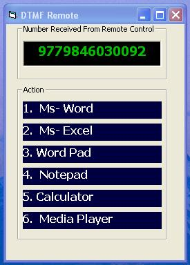



## DTMF DECODER UPDATED V2\.0

### Description

This is next version of My DTMF project. Now this can detect tone on the fly. This gets input from electric mic, Line In etc. Just you can play DTMF tone from your telephone speaker and see real time detection.I have used some functions from Wave In recorder Project from PSC(Im grateful to rm_code). Now it also can run windows application from relative tone. You can download and Please Vote Me.
 
### More Info
 
The program gets input from line in, telephone,electric mic and analyses DTMF digit for PC

This detect DTMF ton on fly and controlls your PC

             |
---                |---
**Submitted On**   |2006-12-09 21:39:38
**By**             |[Sagar Devkota](https://github.com/Planet-Source-Code/PSCIndex/blob/master/ByAuthor/sagar-devkota.md)
**Level**          |Intermediate
**User Rating**    |4.8 (24 globes from 5 users)
**Compatibility**  |VB 5\.0, VB 6\.0
**Category**       |[Sound/MP3](https://github.com/Planet-Source-Code/PSCIndex/blob/master/ByCategory/sound-mp3__1-45.md)
**World**          |[Visual Basic](https://github.com/Planet-Source-Code/PSCIndex/blob/master/ByWorld/visual-basic.md)
**Archive File**   |[DTMF\_DECOD2036591292006\.zip](https://github.com/Planet-Source-Code/sagar-devkota-dtmf-decoder-updated-v2-0__1-67331/archive/master.zip)

